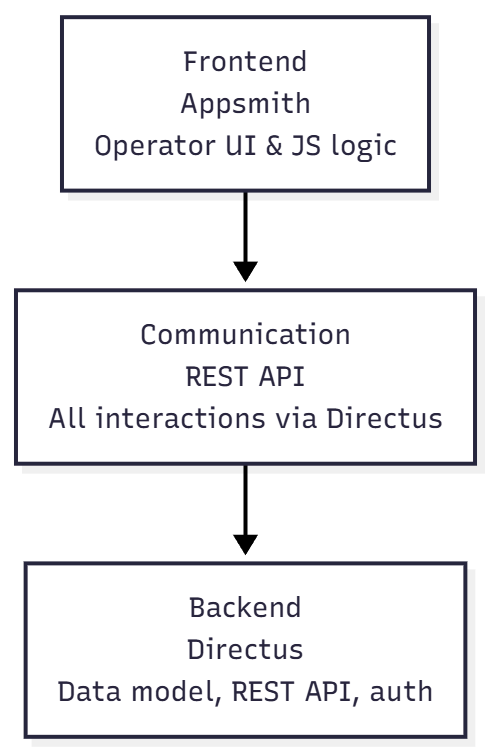
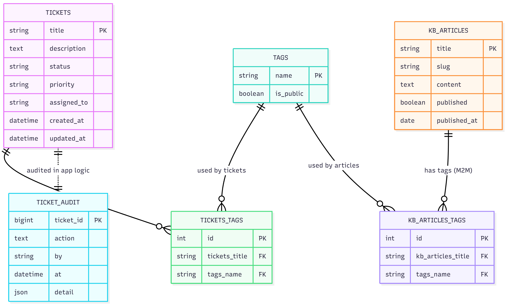

# Query Board — Directus + Appsmith

Modern, minimal internal support operations tool built with Directus (backend) and Appsmith (frontend). This README is a concise project presentation: what the app does, architecture, how to run it locally, demo credentials, and where to find core implementation notes.

---

## Quick links
- Repository: https://github.com/Joothis/QueryBoard
- Live demo (Appsmith): https://joothis.appsmith.com/applications/691e819e8f6f49085afa62a7/pages/69203db2af71d03c33a72594

---

## Demo credentials
- Operator user
  - Email: email@gmail.com
  - Password: password

- Admin user(for directus :https://queryboard.directus.app)
  - Email: admin@gmail.com
  - Password: password

Note: The export includes seed data. Configure your environment to point to a Directus instance (see Setup below).

---

## One-line summary
Build an internal ticket management dashboard where agents can list, filter, update, and bulk-manage support tickets. All reads/writes use Directus REST APIs; Appsmith hosts the UI and JavaScript business logic.

---

## Architecture

  

Three-layer architecture: Directus as the authoritative backend (data model, RBAC, REST endpoints, audit storage), Appsmith as the operator-facing frontend (pages, widgets, JSObjects implementing validations and bulk workflows), and REST API communication between them.

| Layer | Technology | Responsibilities |
|---|---:|---|
| Backend | Directus | Data model, business rules, authentication & permissions, audit records, REST endpoints |
| Frontend | Appsmith | Operator UI, pages/widgets, custom JS for validation, sequential bulk operations, and audit wiring |
| Communication | REST API (Directus) | All read/write interactions (GET/PATCH/POST), pagination, filtering, and query-level permissions |

Notes: Appsmith JSObjects implement sequential PATCH loops with per-ticket audit creation and user feedback; environment vars needed: DIRECTUS_URL, DIRECTUS_API_TOKEN.

---

## Data model (high level)

  
  
Directus database schema (collections and relations)

- Collections:
  - tickets — title, description, status, priority, assigned_to, tags (M2M), created_at, updated_at
  - tags — name, is_public
  - kb_articles — title, slug, content, tags (M2M), published, published_at
  - ticket_audit — ticket_id, action, by, at, detail

- Relations:
  - tickets ↔ tags (M2M — via junction table)
  - kb_articles ↔ tags (M2M — via junction table)
  - ticket_audit → tickets (M2O)

---

## Roles & permissions
- operator: read/update tickets, read tags, read published kb_articles
- public: read public tags & published kb_articles only

---

## Key features (front-end)
1. Ticket list screen
   - Paginated table powered by `GET /items/tickets`
   - Columns: title, status (color-coded), priority, assigned_to, tags, updated_at
   - Custom filters implemented via Appsmith JS and API query parameters: status, priority, tags, and free-text search across title/description

2. Ticket detail drawer
   - Opens from the table row; editable fields: status, priority, assigned_to, tags
   - Description is read-only by default; certain flows append text (e.g., close reason for high-priority tickets)
   - Save flow: validate → PATCH /items/tickets/:id → refresh table → POST /items/ticket_audit

3. Bulk actions
   - Bulk Close: closes selected tickets; requires close reason if any ticket has high priority; reason appended to description before PATCH
   - Bulk Assign Owner: validates email domain against an allowlist (e.g. company.com, support.io)
   - Bulk Add Tag: adds a tag to all selected tickets
   - All bulk operations execute sequential PATCH requests, handle failures, refresh the table, and append audit entries per ticket

4. Audit log
   - Shows last 10 entries per ticket via `GET /items/ticket_audit?filter[ticket_id]=:id`
   - Each update creates a `ticket_audit` record (ticket_id, action, by, at, detail)

---

## Appsmith / JS logic highlights
- Manual validation and input sanitization
- Email domain allowlist for owner assignment
- Async loops with sequential PATCH calls for bulk operations (with error handling and per-ticket audit creation)
- Append-close-reason logic for high-priority closures
- User feedback via success toasts and error modals

---

## Directus REST endpoints used
| Action | Method | Endpoint |
|---|---:|---|
| Fetch tickets | GET | /items/tickets |
| Fetch tags | GET | /items/tags |
| Fetch kb articles | GET | /items/kb_articles |
| Update ticket | PATCH | /items/tickets/:id |
| Add audit record | POST | /items/ticket_audit |
| Fetch audit logs | GET | /items/ticket_audit?filter[ticket_id]=:id |

---

## Setup / Run (local)
1. Import the Appsmith export into your Appsmith instance (the `pages/` folder contains the exported pages and JS objects).
2. Ensure Directus is running and reachable.
3. Set environment variables in Appsmith:
   - DIRECTUS_URL — base URL of your Directus instance
   - DIRECTUS_API_TOKEN — API token with appropriate permissions
4. Seed data is included in the export; use the provided admin credentials to verify.

---

## Where to look in this repository
- Appsmith pages and widgets: `pages/` (contains pages, queries, JSObjects, and widgets)
- Datasources: `datasources/` (Directus connection definitions)
- JS libraries: `jslibs/`

---
